Tasks 1-4 are done in SQLite and the rest of tasks in PostgreSQL.
# Task 1

For the following queries I changed the arguments from the function `SUBSTRING` to select the following chars.
``` SQL
WITH RECURSIVE Alph(c) AS (
	SELECT 'A'
	UNION ALL
	SELECT CHAR(UNICODE(c) + 1) FROM Alph
	WHERE UNICODE(c) < UNICODE('Z')
)
SELECT * FROM Alph
WHERE c NOT IN (SELECT DISTINCT SUBSTRING(Code, 1, 1) FROM country)
```
Answers:
- First letter:
	
- Second letter:
	
- Third letter:
	
# Task 2
```SQL
WITH A AS (
	SELECT Population / CAST(SurfaceArea AS FLOAT) AS Ratio
	FROM country
)
SELECT 'Maximum' as Metric, MAX(Ratio) as Value FROM A
UNION
SELECT 'Minimum', MIN(Ratio) FROM A
UNION
SELECT 'Median', MEDIAN(Ratio) FROM A;
```
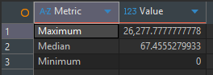
# Task 3

```SQL
SELECT
	country.Name,
	city.Population / CAST(country.Population AS FLOAT) * 100 AS Percentage
FROM country
JOIN city
ON country.Capital = city.ID
ORDER BY Percentage
LIMIT 10;
```
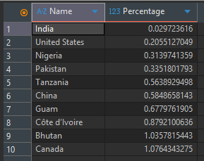
Unrelated: In this query Singapore gives >100%. It seems that the data is not 100% accurate. Because of that I learned that Singapore is city-state, for whatever reason I thought that is a big country. What a surprise.
# Task 4

```SQL
SELECT AVG(c.LifeExpectancy) AS LifeExpectancy,
	cl.Language
FROM country AS c
JOIN countrylanguage AS cl
ON c.Code = cl.CountryCode
GROUP BY cl.Language
```
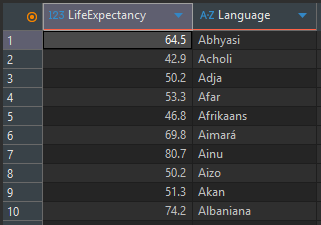

The following query gives a more precise result. We take `LifeExpectancy` and multiply it with the part of population which speaks that language. Then we divide it with the total population of respective language. 
```SQLite
SELECT SUM(c.LifeExpectancy * cl.Percentage / 100.0 * c.Population) / SUM(cl.Percentage / 100.0 * c.Population) AS LifeExpectancy,
	cl.Language
FROM country AS c
JOIN countrylanguage AS cl
ON c.Code = cl.CountryCode
GROUP BY cl.Language
```
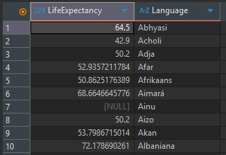

# Task 5
Starting from here, everything was done in PostgreSQL.

In the CTE we filter the employee department history to have the `StartDate` less than May 01, 1999 and the `EndDate` bigger or null. This should return at most 1 record for every employee, this was checked with the last query.
```SQL
with "A" as (
	select edh."DepartmentID",
		count(edh."DepartmentID") as "Nr of employees"
	from employeedepartmenthistory as edh
	where (edh."EndDate" > '1999-05-01' or edh."EndDate" is null) and edh."StartDate" <= '1999-05-01'
	group by edh."DepartmentID"
)
select d."Name" as "Department",
	"A"."Nr of employees"
from "A"
join department as d
on "A"."DepartmentID" = d."DepartmentID"
```
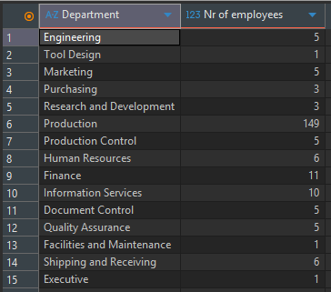
``` SQL
select MAX("cnt")
from (
	select count(edh."EmployeeID") as "cnt"
	from employeedepartmenthistory as edh
	where (edh."EndDate" > '1999-05-01' or edh."EndDate" is null) and edh."StartDate" <= '1999-05-01'
	group by edh."EmployeeID"
)
```

# Task 6
I used a CTE to get the `ChangeRate` between the `AverageRate` and `EndOfDayRate`. After, in a subquery I used `lag` function to calculate the difference of `ChangeRate` between days.
```SQL
with "ChangeRates" as (
	select abs(c."AverageRate" - c."EndOfDayRate") as "ChangeRate",
		c."CurrencyRateDate" as "Date"
	from currencyrate as c
	where c."FromCurrencyCode" = 'USD' and c."ToCurrencyCode" = 'CAD'
)
select "Diff", "Date"
from (
	select abs("ChangeRate" - lag("ChangeRate") over (order by "Date")) as "Diff",
		"Date" as "Date"
	from "ChangeRates"
)
where "Diff" is not null
order by "Diff" desc
limit 1
```
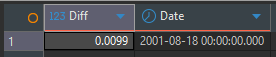
# Task 7
The recursive CTE calculates all the chains, some of which are duplicates. I used `row_number` to filter and get the chains with maximum depth for every employee.
```SQL
with recursive subordination_chains as (
	select
		"EmployeeID",
		"ManagerID",
		cast("EmployeeID" as varchar) as "chain",
		1 as "depth"
	from employee
	union all
	select
		sc."EmployeeID",
		e."ManagerID",
		cast(e."EmployeeID" as varchar) || ' -> ' || sc."chain",
		sc."depth" + 1
	from subordination_chains as sc
	inner join Employee as e
	on e."EmployeeID" = sc."ManagerID"
	where sc."depth" < 10
)
select "EmployeeID", "chain"
from (
	select
		"EmployeeID",
		"chain",
		row_number() over (partition by "EmployeeID" order by "depth" desc) as "RowNumber"
	from subordination_chains
)
where "RowNumber" = 1
order by "EmployeeID"
```
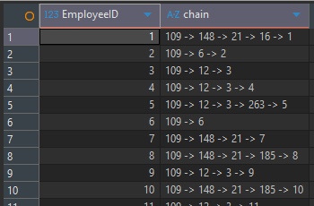
# Task 8

I tried to find any correlation between the vendor's `CreditRating` and the total monetary amount of transactions, but it could find any strong correlation. We can say that there is some, based on that the `Avg Total Money` is bigger for `CreditRating` 4 and 5, compared to 1, 2, 3. 

But also this could be a coincidence, because the `Max Total Money` for `CreditRating` 1, and 2 are bigger than the `Max Total Money` of 5, and `CreditRating` 4,5 doesn't have many vendors. Looking at the second query we can see that `CreditRating` 4 and 5 only have 2 vendors, and of those, 1 vendors from each `CreditRating` doesn't have any `Orders`. Third query only counts the vendors which have orders. 

In that case I think the `average` function benefits the `CreditRating` 4 and 5 because they have a small sampling pool.

Conclusion: There is no correlation between the total monetary amount of transactions and `CreditRating`.
```SQL
with tmp as (
	select v."VendorID",
		v."CreditRating",
		sum(pod."OrderQty" * pod."UnitPrice") as "TotalMoney",
		count(poh."PurchaseOrderID") as "TotalOrders"
	from vendor as v
	join purchaseorderheader as poh
	on v."VendorID" = poh."VendorID"
	join purchaseorderdetail as pod
	on poh."PurchaseOrderID" = pod."PurchaseOrderID"
	group by v."VendorID"
	order by "CreditRating", "TotalMoney"
)
select avg("TotalOrders") as "Avg Total Orders",
	avg("TotalMoney") as "Avg Total Money",
	min("TotalMoney") as "Min Total Money",
	max("TotalMoney") as "Max Total Money"
from tmp
group by tmp."CreditRating"
```
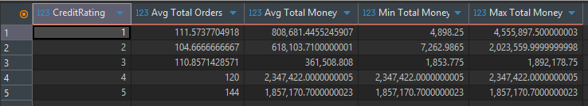

```SQL
select v."CreditRating",
	count(v."CreditRating") as "Count Vendors"
from vendor as v
group by v."CreditRating"
order by v."CreditRating"
```
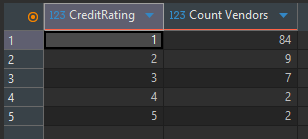

```SQL
select v."CreditRating",
	count(v."CreditRating") as "Count Vendors With Orders"
from vendor as v
where v."VendorID" in
	(select "VendorID" from purchaseorderheader)
group by v."CreditRating"
order by v."CreditRating"
```
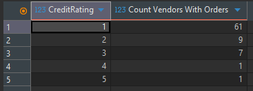

# Task 9


```SQL
select
	"Gender",
	avg("Rate"),
	min("Rate"),
	max("Rate"),
	stddev("Rate")
from (
	select e."Gender",
		eph."Rate",
		rank() over (partition by e."EmployeeID" order by eph."RateChangeDate" desc ) as "rank"
	from employee as e
	left join employeepayhistory as eph
	on e."EmployeeID" = eph."EmployeeID"
	order by e."EmployeeID"
)
where "rank" = 1
group by "Gender"
```
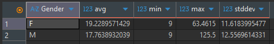

We can observe that the employee pay rate correlates with gender. Even if female employees have a lower maximum pay rate ~63.5$ than male employees 125.5\$, they still have a higher average pay rate of ~19.2\$.

```SQL
select
	"MaritalStatus",
	avg("Rate"),
	min("Rate"),
	max("Rate"),
	stddev("Rate")
from (
	select
		e."MaritalStatus",
		eph."Rate",
		rank() over (partition by e."EmployeeID" order by eph."RateChangeDate" desc ) as "rank"
	from employee as e
	left join employeepayhistory as eph
	on e."EmployeeID" = eph."EmployeeID"
	order by e."EmployeeID"
)
where "rank" = 1
group by "MaritalStatus"
```
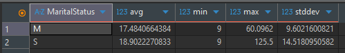

Employee pay rate correlates with marital status, with single employees earning higher average pay rates than married employees.

```SQL
select
	cast("years"*10 as varchar)|| '-' || cast("years"*10+9 as varchar) as "Years",
	avg("Rate"),
	min("Rate"),
	max("Rate"),
	stddev("Rate")
from (
	select
		floor(extract(year from age(eph."RateChangeDate", e."BirthDate"))/10) as "years",
		eph."Rate",
		rank() over (partition by e."EmployeeID" order by eph."RateChangeDate" desc ) as "rank"
	from employee as e
	left join employeepayhistory as eph
	on e."EmployeeID" = eph."EmployeeID"
	order by e."EmployeeID"
)
where "rank" = 1
group by "years"
order by "years"
```
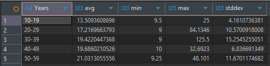

Employee pay rate correlates with age, with younger employees having a lower pay rate compared with older employees. This positive correlation suggests that compensation increases with experience and career progression.

# Task 10
I used an AI agent to criticise my solution, and from the first try it hallucinated. 
It said that: 
	'SQLite doesn't have `CHAR()` and `UICODE()` functions.'  
But on the SQLite documentation page these functions are available. It recommended to use `ASCII()` function, which actually is not available. 
After which I have stated to it, to look for the documentation, it stopped to hallucinate.

The most useful was to use 'Socratic questioning'. It takes more time but is more effective than just asking an AI for some explanations. Most probably this comes down to the fact that I get more engaged answering questions. In the end, I put more effort into understanding the topic/question.

I found the AI to be most useful in giving new ideas and helping in learning new things, rather than just asking it to resolve tasks. If the prompts are small it tends to generate queries that don't fit to my ideas, and if I try to steer the AI to give what I want, I can loose myself in a rabbit hole of trial and error. In the end it was faster to do most of the part myself with a bit of help from AI, with suggestions. 

I see the AI as a tool capable of speeding up the development time, only in the case when you have a lot of queries to create. Then I think it's good to invest some time in engineering some good prompts for AI, like in the attached papers from the 'Socratic questioning' paragraph.


